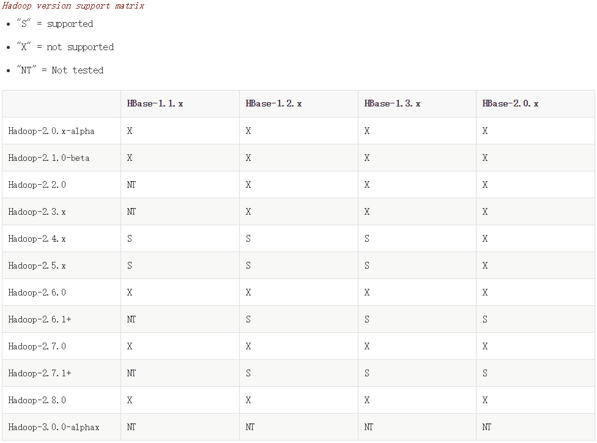

====================
[部署]-集群部署Hbase
====================

零、背景介绍
------------

0.1 部署说明::
    
    操作系统: Centos 6.5
    系统内核: Linux version 2.6.32-431.el6.x86_64
    部署方式: tar
    操作用户: root
    运行用户: hdfs
    软件版本: hbase-1.2.6
    所需文件: hbase-1.2.6-bin.tar.gz, jdk-8u60-linux-x64.gz

0.2 节点说明:

.. list-table::
  :widths: 10 10 30
  :header-rows: 1

  * - Hostname
    - Address
    - Role
  * - VM01
    - 192.168.182.101
    - HMaster, HRegionServer
  * - VM02
    - 192.168.182.102
    - HMaster, HRegionServer
  * - VM03
    - 192.168.182.103
    - HMaster, HRegionServer
    
0.3 目录说明::

    程序目录: /opt/hbase
    配置目录: 
    数据目录: /data/hado/
    日志目录: /data/hadoop/hdfs/logs
    临时目录: /data/hadoop/hdfs/vars/tmp
    PID 目录: /data/hadoop/hdfs/vars/run

依赖说明::

0.4 端口说明::

    8020:  namenode 监听的端口，HDFS的入口。
    50070: namenode 管理页面（Web UI）。 

0.5 补充说明::

    执行步骤前请查看此步骤下方提示，如遇到红色提示要慎重操作此步骤可能影响正常进入，蓝色为说明提示。

兼容矩阵:

官方文档::

    http://hbase.apache.org/book.html

一、解决依赖
------------

..
    加入环境检测
    1. 检测jdk版本，删除不兼容jdk
    2. 检测主机名对应关系
    3. 时间检测，检查时间是否同步，配置NTP
    4. 存储空间检测，检查空间是否满足要求
    5. 文件、进程打开数

1.1 安装依赖组件:

安装jdk::

    # 安装软件包
    $ mkdir -v /usr/java
    $ tar xvf jdk-8u60-linux-x64.gz -C /usr/java
    $ ln -sv /usr/java/jdk1.8.0_60 /usr/java/latest
    $ ln -sv /usr/java/latest /usr/java/default
    $ chown -R root:root /usr/java/jdk1.8.0_60
    $ echo 'export JAVA_HOME=/usr/java/default' > /etc/profile.d/java.sh
    $ echo 'export PATH=${PATH}:${JAVA_HOME}/bin' >> /etc/profile.d/java.sh
    $ source /etc/profile.d/java.sh

    # 验证安装，显示如下内容表示成功。
    $ java -version
    java version "1.8.0_60"
    Java(TM) SE Runtime Environment (build 1.8.0_60-b27)
    Java HotSpot(TM) 64-Bit Server VM (build 25.60-b23, mixed mode)

1.2 创建运行用户::

    $ useradd -M -s /sbin/nologin -u 60010  hbase

1.3 配置时间同步::

    $ ntpdate cn.pool.ntp.org
    $ crontab -e
    # 每两小时 Linux 系统就会自动的进行网络时间校准
    00 */2 * * * root /usr/sbin/ntpdate cn.pool.ntp.org

1.4 修改资源限制:

.. code-block:: bash

    $ vim /etc/security/limits.d/90-nofile.conf
    # 添加如下内容:
    hbase          soft    nofile     65535
    hbase          hard    nofile     65535

    $ vim /etc/security/limits.d/90-nproc.conf
    # 添加如下内容:
    hbase          soft    nproc     unlimited
    hbase          hard    nproc     unlimited

1.5 HDFS相关操作:

修改HDFS相关配置:

.. code-block:: bash

    $ vim /data/hadoop/conf/hdfs-site.xml
    # 添加如下信息:
    <property>
        <name>dfs.datanode.max.transfer.threads</name>
        <value>4096</value>
    </property>

    <property>
        <name>dfs.datanode.max.xcievers</name>
        <value>4096</value>
    </property>

.. warning:: 

    修改完HDFS参数后，需要重启HDFS集群，否则参数不生效。

在HDFS中创建所需目录::

    su hdfs -s /bin/bash -c "hdfs --config /data/hadoop/hdfs/conf  dfs -mkdir /hbase"
    su hdfs -s /bin/bash -c "hdfs --config /data/hadoop/hdfs/conf  dfs -chown hbase:hbase /hbase"
    su hdfs -s /bin/bash -c "hdfs --config /data/hadoop/hdfs/conf  dfs -ls /"

二、安装程序
------------

2.1 解压缩软件包::

    $ cd /tmp
    $ tar xf hbase-1.2.6-bin.tar.gz -C /opt
    $ mv /opt/hbase-1.2.6 /opt/hbase
    $ echo "version: hbase-1.2.6" >> /opt/hbase/VERSION.md

2.2 整理程序目录::

    $ mv /opt/hbase/conf /opt/hbase/conf.orig
    $ rm -fv /opt/hbase/bin/*.cmd
    $ rm -fv /opt/hbase/conf.orig/*.cmd
    $ rm -rfv /opt/hbase/{*.txt,LEGAL,docs}

2.3 创建所需目录::

    $ mkdir -pv /data/hbase/{conf,logs,vars}
    $ mkdir -pv /data/hadoop/hdfs/vars/{run,tmp}

2.4 创建所需文件::

    $ cp /opt/hbase/conf.orig/* /data/hbase/conf

2.5 修改文件权限::

    $ chown -R root:root /opt/hbase
    $ chown -R hbase:hbase /data/hbase
    
2.6 修改环境变量::

    $ ln -sv /opt/hbase/bin/hbase /usr/bin

2.6 设置开机启动::

    12

.. warning::

    如果后续准备使用 supervisor 启动，则不要执行 ``2.6步骤``。

三、修改配置
------------

3.1 编辑配置文件:

.. code-block:: xml

    $ vim /data/hadoop/hdfs/conf/core-site.xml
    # 替换如下内容:
    <?xml version="1.0" encoding="UTF-8"?>
    <?xml-stylesheet type="text/xsl" href="configuration.xsl"?>

    <configuration>

      <property>
        <name>hbase.cluster.distributed</name>
        <value>true</value>
      </property>

      <property>
        <name>hbase.rootdir</name>
        <value>hdfs://VM01:8020/hbase</value>
      </property>

      <property>
        <name>hbase.tmp.dir</name>
        <value>/data/hbase/vars/tmp</value>
      </property>

      <property>
        <name>hbase.zookeeper.quorum</name>
        <value>ZOO1,ZOO2,ZOO3:/hbase</value>
      </property>

    </configuration>

3.2 修改默认配置目录:
    
.. code-block:: bash
    
    $ vim /opt/hbase/bin/hbase-config.sh
    # 第25行加入如下内容
    HBASE_CONF_DIR="/data/hbase/conf"
    
3.3 修改日志、PID目录::

    echo "export HBASE_LOG_DIR=/data/hbase/logs" >> /data/hbase/conf/hbase-env.sh
    echo "export HBASE_PID_DIR=/data/hbase/vars/run" >> /data/hbase/conf/hbase-env.sh

四、启动程序
------------

4.1 启动应用程序:
    
二进制启动::

    # Master 启动:
    $ cd /opt/hbase/bin
    $ su -s /bin/bash hbase -c "./hbase-daemon.sh --config /data/hbase/conf start master"

    # Regionserver 启动:
    $ cd /opt/hbase/bin
    $ su -s /bin/bash hbase -c "./hbase-daemon.sh --config /data/hbase/conf start regionserver"

.. note::

    运行是可以用参数 ``--config`` 指定配置目录，如果不指定则使用 ``3.2步骤`` 所配置的目录。

SysV启动脚本::

    # NameNode 启动:
    $ service namenode start

    # DataNode 启动:
    $ service datanode start

    # SecondaryNamenode 启动:
    $ service secondarynamenode start

.. warning::

    使用SysV脚本启动需要 ``redhat-lsb-core`` 此程序包，请提前安装。
    安装命令 ``yum install redhat-lsb-core``

supervisor启动配置:

.. code-block:: bash

    [program:mysql]
    command=/usr/local/python2.7.9/bin/pidproxy /data/mysql/data/mysqld.pid
     /opt/mysql/bin/mysqld_safe --defaults-file=/etc/my.cnf
    stdout_logfile=/tmp/mysql.log
    stdout_logfile_maxbytes=100MB
    stdout_logfile_backups=10

.. note::
    
    选择一种启动方式即可，一般使用SysV启动脚本启动即可。

4.2 检测启动状态::

    $ mysqladmin -h 127.0.0.1 -p 3306 ping
    mysqld is alive         # 返回此结果运行正常           

4.3 启动后续操作:

安全初始化root账号::

    $ mysql -e "GRANT ALL PRIVILEGES ON *.* TO 'root'@'%' IDENTIFIED BY 'ylzone' WITH GRANT OPTION"
    $ mysql -e "DELETE FROM mysql.user WHERE host != '%'"
    $ mysql -e "FLUSH PRIVILEGES"
    $ mysql -u root -p ylzone                               # 连接测试

.. note::

    如果上述如步骤均操作正常，则mysql部署完成。酌情把相关地址、账号密码发送给使用者。

五、附属功能
------------

5.1 环境规范操作

添加include支持::

    $ ln -sv /opt/mysql/include /usr/include/mysql

添加lib支持::

    $ echo '/opt/mysql/lib' > /etc/ld.so.conf.d/mysql.conf
    $ ldconfig                                               # 让系统重新载入系统库

添加man帮助:

.. code-block:: bash
    
    $ vim /etc/man.config
    MANPATH /opt/mysql/man
    
.. note::

   ``5.1步骤`` 主要为支持编译等相关操，如无相关需要可忽略此步骤。

..
   添加管理用户进行对 mysql的管理
   如：添加admin或super用户，之后在sudoer中加入可操作mysql相关命令
