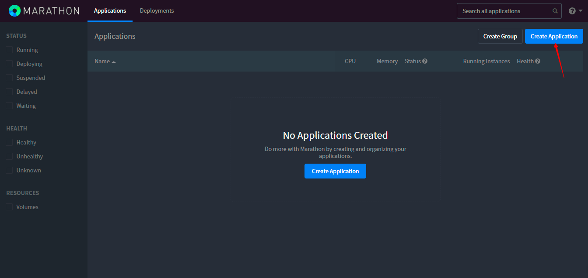
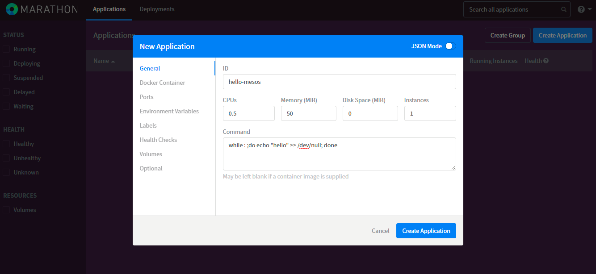
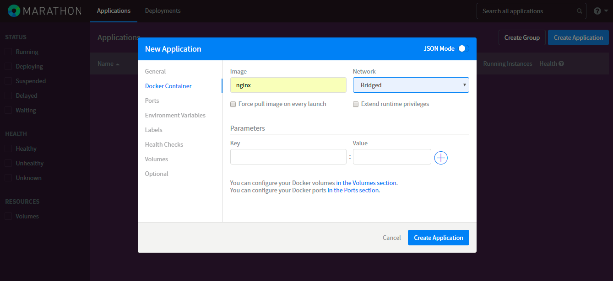
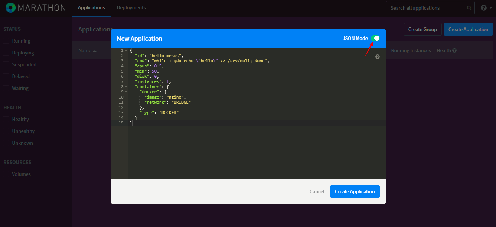
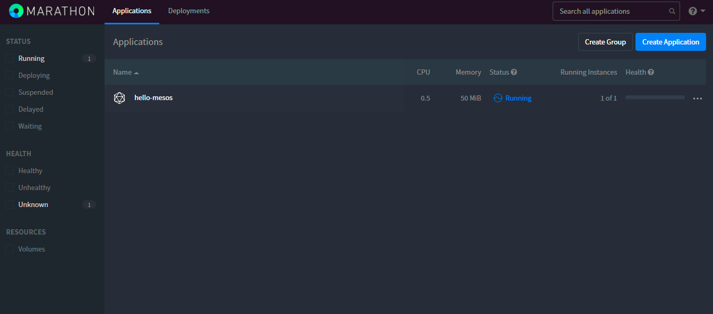

=======================
[操作]-Marathon常用操作
=======================

1. 创建一个Docker应用
---------------------

操作执行流程::

    提交申请给Marathon --> 使用Mesos接口想Master申请资源 --> 通知Slave节点执行任务

命令行接口:
    
.. code-block:: bash

    # 创建JSON模板文件。
    $ cat > /tmp/hello-mesos.json << EOF
    {
      "id": "hello-mesos",
      "cmd": "while : ;do echo \"hello\" >> /dev/null; done",
      "cpus": 0.5,
      "mem": 50,
      "disk": 0,
      "instances": 1,
      "container": {
        "docker": {
          "image": "nginx",
          "network": "BRIDGE"
        },
        "type": "DOCKER"
      }
    }
    EOF
    
    # 使用Mrathon接口申请创建Application。
    $ curl -X POST http://192.168.182.101:8080/v2/apps \
           -H "Content-type:application/json" \
           -d @/tmp/hello-mesos.json 
    {"id":"/hello-mesos","cmd":"while : ;do echo \"hello\" >> /dev/null; done","args":null,"user":null,"env":{},"instances":1,"cpus":0.5,"mem":50,"disk":0,"gpus":0,"executor":"","constraints":[],"uris":[],"fetch":[],"storeUrls":[],"backoffSeconds":1,"backoffFactor":1.15,"maxLaunchDelaySeconds":3600,"container":{"type":"DOCKER","volumes":[],"docker":{"image":"nginx","network":"BRIDGE","portMappings":[],"privileged":false,"parameters":[],"forcePullImage":false}},"healthChecks":[],"readinessChecks":[],"dependencies":[],"upgradeStrategy":{"minimumHealthCapacity":1,"maximumOverCapacity":1},"labels":{},"ipAddress":null,"version":"2017-09-15T08:44:30.166Z","residency":null,"secrets":{},"taskKillGracePeriodSeconds":null,"unreachableStrategy":{"inactiveAfterSeconds":300,"expungeAfterSeconds":600},"killSelection":"YOUNGEST_FIRST","ports":[0],"portDefinitions":[{"port":0,"protocol":"tcp","name":"default","labels":{}}],"requirePorts":false,"tasksStaged":0,"tasksRunning":0,"tasksHealthy":0,"tasksUnhealthy":0,"deployments":[{"id":"480e8094-6204-44e2-835b-31af16324c97"}],"tasks":[]}

WEB图形接口:

a.点击 Create Application

b.填写 General 页面信息，CPUs 为权重值。

c.填写 Docker Container 页面信息。

d.点击 JSON Mode 查看接口内容。

e.点击 Create Application 按钮进行创建。

f.创建后结构如下。

