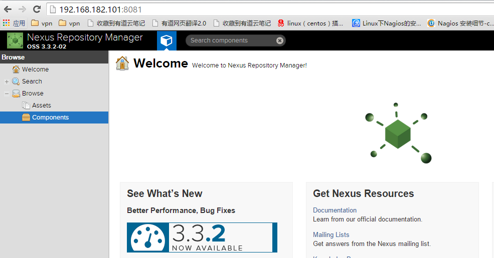

=================
[配置]-Docker仓库
=================

Docker 1.9.1

Docker 1.7.1 上传私有仓库失败

1 创建docker仓库
----------------

登录系统并点在设置 Repositories 选项卡中中选择 Create repository

选择创建 ``docker(hosted)``

仓库类型有很多，docker 相关总共有三种类型:

* hosted: 本地存储，即同 docker 官方仓库一样提供本地私服功能
* proxy: 提供代理其他仓库的类型，如 docker 中央仓库
* group: 组类型，实质作用是组合多个仓库为一个地址

2 创建一个私服
--------------

选择 hosted 类型仓库，然后输入一个仓库名，并勾选 HTTP 选项，端口任意即可

之后点击 ``Create repository`` 按钮

3 测试私服
----------

3.1 修改docker参数::

    $ cd /tmp
    $ tar xf nexus-3.3.2-02-unix.tar.gz -C /opt
    $ ln -sv /opt/nexus-3.3.2-02/ /opt/nexus

3.2 测试 ``push`` 和 ``pull`` 镜像::

    $ mkdir /data/nexus

3.3 创建所需文件::
    
    $ mv /opt/sonatype-work /data/nexus

3.4 修改文件权限::

    $ chown -R root:root /opt/nexus-3.3.2-02
    $ chown -R nexus:nexus /data/nexus

4 修改配置
----------

4.1 编辑配置启动用户:

.. code-block:: bash

    $ vim /opt/nexus-3.3.2-02/bin/nexus.rc
    # 添加如下内容:
    run_as_user="nexus"

4.2 编辑配置工作目录:

.. code-block:: bash

    $ vim /opt/nexus-3.3.2-02/bin/nexus.vmoptions
    # 添加如下内容:
    -Xms1200M
    -Xmx1200M
    -XX:MaxDirectMemorySize=2G
    -XX:+UnlockDiagnosticVMOptions
    -XX:+UnsyncloadClass
    -XX:+LogVMOutput
    -XX:LogFile=/data/nexus/sonatype-work/nexus3/log/jvm.log
    -Djava.net.preferIPv4Stack=true
    -Dkaraf.home=.
    -Dkaraf.base=.
    -Dkaraf.etc=etc/karaf
    -Djava.util.logging.config.file=etc/karaf/java.util.logging.properties
    -Dkaraf.data=/data/nexus/sonatype-work/nexus3
    -Djava.io.tmpdir=/data/nexus/sonatype-work/nexus3/tmp
    -Dkaraf.startLocalConsole=false

5 启动程序
----------

5.1 启动命令::
    
    # 以前台方式运行
    sudo -u nexus /opt/nexus-3.3.2-02/bin/nexus run

    # 后台运行
    sudo -u nexus /opt/nexus-3.3.202/bin/nexus start

5.3 验证部署:

浏览器访问 http:IP:8081 默认账户 admin 密码 admin123 登录

6 规范环境
----------

6.2 开机启动::

    $ ln -s /opt/nexus/bin/nexus /etc/init.d/nexus
    $ cd /etc/init.d
    $ chkconfig --add nexus
    $ chkconfig --levels 345 nexus on
    $ service nexus start

7 补充说明
----------

7.1 主要配置说明:
