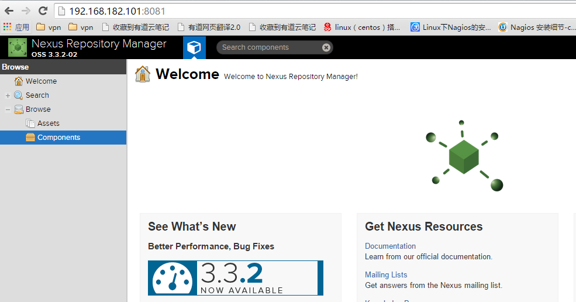

================
[部署]-部署Nexus
================

1 背景介绍
----------

1.1 部署说明::
    
    操作系统: Centos 6.5
    系统内核: Linux version 2.6.32-431.el6.x86_64
    部署类型: tar
    操作用户: root
    运行用户: nexus
    软件版本: nexus-3.3.2-02

1.2 所需文件::

    jdk-8u60-linux-x64.gz
    nexus-3.3.2-02-unix.tar.gz

1.3 节点说明::

    192.168.182.101    VM01    nexus

1.4 目录说明::

    部署位置: /opt/nexus
    数据目录: /data/nexus
    
1.5 相关地址::

    下载地址: https://www.sonatype.com/download-oss-sonatype
    官方文档: https://books.sonatype.com/nexus-book/reference3/install.html#installation-java

1.6 相关说明::

    默认监听端口: 8081

2 解决依赖
----------

2.1 安装JDK::

    $ mkdir /usr/java 
    $ tar xf jdk-8u60-linux-x64.gz -C /usr/java
    $ ln -sv /usr/java/jdk1.8.0_60 /usr/java/latest
    $ ln -sv /usr/java/latest /usr/java/default
    $ chown -R root:root /usr/java/jdk1.8.0_60
    $ echo 'export PATH=$PATH:/usr/java/default/bin' > /etc/profile.d/java.sh
    $ source /etc/profile.d/java.sh

2.2 创建运行用户::

    $ useradd -s /sbin/nologin -u 8081 nexus

3 安装程序
----------

3.1 解压软件包::

    $ cd /tmp
    $ tar xf nexus-3.3.2-02-unix.tar.gz -C /opt
    $ ln -sv /opt/nexus-3.3.2-02/ /opt/nexus

3.2 创建所需目录::

    $ mkdir /data/nexus

3.3 创建所需文件::
    
    $ mv /opt/sonatype-work /data/nexus

3.4 修改文件权限::

    $ chown -R root:root /opt/nexus-3.3.2-02
    $ chown -R nexus:nexus /data/nexus

4 修改配置
----------

4.1 编辑配置启动用户:

.. code-block:: bash

    $ vim /opt/nexus-3.3.2-02/bin/nexus.rc
    # 添加如下内容:
    run_as_user="nexus"

4.2 编辑配置工作目录:

.. code-block:: bash

    $ vim /opt/nexus-3.3.2-02/bin/nexus.vmoptions
    # 添加如下内容:
    -Xms1200M
    -Xmx1200M
    -XX:MaxDirectMemorySize=2G
    -XX:+UnlockDiagnosticVMOptions
    -XX:+UnsyncloadClass
    -XX:+LogVMOutput
    -XX:LogFile=/data/nexus/sonatype-work/nexus3/log/jvm.log
    -Djava.net.preferIPv4Stack=true
    -Dkaraf.home=.
    -Dkaraf.base=.
    -Dkaraf.etc=etc/karaf
    -Djava.util.logging.config.file=etc/karaf/java.util.logging.properties
    -Dkaraf.data=/data/nexus/sonatype-work/nexus3
    -Djava.io.tmpdir=/data/nexus/sonatype-work/nexus3/tmp
    -Dkaraf.startLocalConsole=false

5 启动程序
----------

5.1 启动命令::
    
    # 以前台方式运行
    sudo -u nexus /opt/nexus-3.3.2-02/bin/nexus run

    # 后台运行
    sudo -u nexus /opt/nexus-3.3.202/bin/nexus start

5.3 验证部署:

浏览器访问 http:IP:8081 默认账户 admin 密码 admin123 登录

6 规范环境
----------

6.2 开机启动::

    $ ln -s /opt/nexus/bin/nexus /etc/init.d/nexus
    $ cd /etc/init.d
    $ chkconfig --add nexus
    $ chkconfig --levels 345 nexus on
    $ service nexus start

7 补充说明
----------

7.1 主要配置说明:
