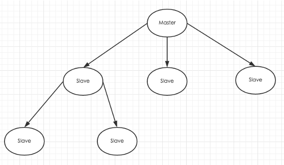

===============
[部署]-集群配置
===============

1 原理介绍
----------

1.1 Redis主从同步原理:

    和MySQL主从复制的原因一样，Redis虽然读取写入的速度都特别快，但是也会产生读压力特别大的情况。为了分担读压力，Redis支持主从复制，Redis的主从结构可以采用一主多从或者级联结构，下图为级联结构。

.. note::
    
    Redis主从复制可分为全量同步和增量同步

1.2 全量同步:

    1. 从服务器连接主服务器，发送SYNC命令;
    2. 主服务器接收到SYNC命名后，开始执行BGSAVE命令生成RDB文件并使用缓冲区记录此后执行的所有写命令;
    3. 主服务器BGSAVE执行完后，向所有从服务器发送快照文件，并在发送期间继续记录被执行的写命令;
    4. 从服务器收到快照文件后丢弃所有旧数据，载入收到的快照;
    5. 主服务器快照发送完毕后开始向从服务器发送缓冲区中的写命令; 
    6. 从服务器完成对快照的载入，开始接收命令请求，并执行来自主服务器缓冲区的写命令.

.. image:: ./images/redis_config_master-savle_02.png 

1.3 增量同步:

    Redis增量复制是指Slave初始化后开始正常工作时主服务器发生的写操作同步到从服务器的过程。 
    增量复制的过程主要是主服务器每执行一个写命令就会向从服务器发送相同的写命令，从服务器接收并执行收到的写命令。

1.4 Redis主从同步策略:

    主从刚刚连接的时候，进行全量同步；全同步结束后，进行增量同步。当然，如果有需要，slave 在任何时候都可以发起全量同步。
    redis 策略是，无论如何，首先会尝试进行增量同步，如不成功，要求从机进行全量同步。

.. note::

    Redis主从复制可以不开启dump和aof，这不影响主从复制功能。

2 部署配置
----------

2.0 部署说明::

    操作系统: Centos 6.5
    系统内核: Linux version 2.6.32-431.el6.x86_64
    所需文件: redis-3.2.8.tar.gz
    操作用户: root
    运行用户: redis
    软件版本: redis-3.2.8
    主机说明: 127.0.0.1:6379(master)、127.0.0.1:6378(slave)

2.1 安装所需组件::

    按照部署进行部署、要求如下:
    127.0.0.1:6379 为master
    127.0.0.1:6378 为slave

.. warning::
    
    注意修改配置文件时候不同实例所需的目录要修改好

2.2 修改slave配置文件:

.. code-block:: bash

    # 只需在slave上修改配置文件即可
    # 修改配置/data/redis/conf/redis_6379.conf
    # 修改如下内容:
    slaveof 127.0.0.1 6379     # slaveof master的ip master的端口
    slave-read-only yes

2.3 主从效果测试:

.. code-block:: bash

    # master和slave均启动
    # 在master上执行：
    127.0.0.1:6379> set name "super"
    OK

    # 在slave上执行:
    127.0.0.1:7379> get name
    "super"

3 在线切换
----------

3.0 环境说明::

    操作系统: Centos 6.5
    系统内核: Linux version 2.6.32-431.el6.x86_64
    所需文件: redis-3.2.8.tar.gz
    操作用户: root
    运行用户: redis
    软件版本: redis-3.2.8
    主机说明: 127.0.0.1:6379(m1)、127.0.0.1:6378(m2)

3.1 问题概述:

    由于某些原因，我们可能需要将redis master更换机器，我们可以停机进行更换，但是那样可能影响到用户体验。接下来我们进行在线切换主从服务。

3.2 操作流程:

    1. 根据m1的配置参数配置新实例m2并启动;
    2. 在m2上执行 ``> SLAVEOF m1 port`` ,查看日志或 ``> INFO``;
    3. 等待数据同步之后执行 ``> CONFIG SET slave-read-only no``;
    4. 将业务应用停止并配置到Redis为m2 (切换时最好为完全同步状态);
    5. 在m2上执行 ``> SLAVEOF NO ONE``;
    6. 下线m1主机.

``SLAVEOF``:
    命令用于在 Redis 运行时动态地修改复制(replication)功能的行为。
    通过执行 SLAVEOF host port 命令，可以将当前服务器转变为指定服务器的从属服务器(slave server)。
    如果当前服务器已经是某个主服务器(master server)的从属服务器，那么执行 SLAVEOF host port 将使当前服务器停止对旧主服务器的同步，丢弃旧数据集，转而开始对新主服务器进行同步。

``SLAVEOF NO ONE``:
    对一个从属服务器执行命令 SLAVEOF NO ONE 将使得这个从属服务器关闭复制功能，并从从属服务器转变回主服务器，原来同步所得的数据集不会被丢弃。
