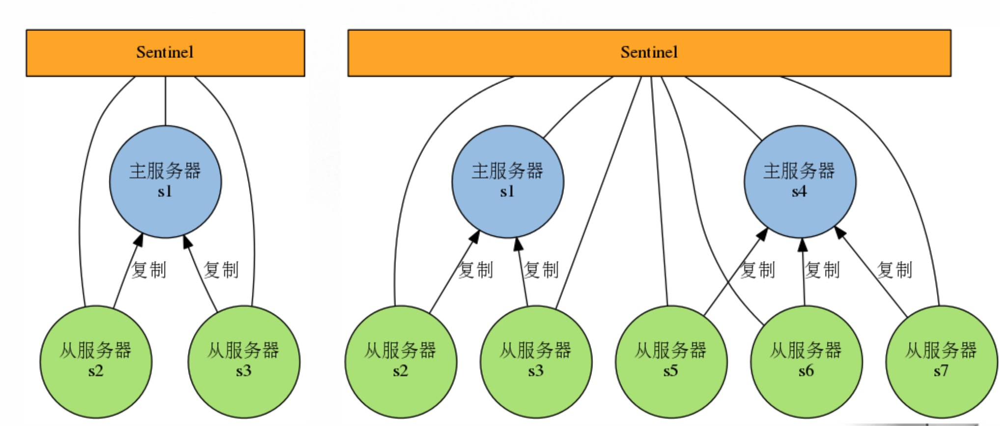

===================
[部署]-Sentinel配置
===================

1 原理介绍
----------

1.1 Sentinel介绍:

    Redis-Sentinel是Redis官方推荐的高可用性(HA) 解决方案，Redis-sentinel本身也是一个独立运行的进程，它能监控多个master-slave集群，发现master宕机后能进行自动切换。Sentinel可以监视任意多个主服务器（复用），以及主服务器属下的从服务器，并在被监视的主服务器下线时，自动执行故障转移操作。

为了防止sentinel的单点故障，可以对sentinel进行集群化，创建多个sentinel。

1.2 主要功能:

    * 不时地监控redis是否按照预期良好地运行;
    * 如果发现某个redis节点运行出现状况，能够通知另外一个进程(例如它的客户端);
    * 能够进行自动切换。当一个master节点不可用时，能够选举出master的多个slave(如果有超过一个slave的话)中的一个来作为新的master,其它的slave节点会将它所追随的master的地址改为被提升为master的slave的新地址。

1.3 Sentinel支持集群:

    很显然，只使用单个sentinel进程来监控redis集群是不可靠的，当sentinel进程宕掉后(sentinel本身也有单点问题，single-point-of-failure)整个集群系统将无法按照预期的方式运行。所以有必要将sentinel集群，这样有几个好处：

    * 即使有一些sentinel进程宕掉了，依然可以进行redis集群的主备切换；
    * 如果只有一个sentinel进程，如果这个进程运行出错，或者是网络堵塞，那么将无法实现redis集群的主备切换（单点问题）;
    * 如果有多个sentinel，redis的客户端可以随意地连接任意一个sentinel来获得关于redis集群中的信息。

2 部署配置
----------

2.0 部署说明::

    # 部署版本说明
    操作系统: Centos 6.5
    系统内核: Linux version 2.6.32-431.el6.x86_64
    所需文件: redis-3.2.8_ylzone.tar.gz
    操作用户: root
    运行用户: redis
    软件版本: redis-3.2.8
    
    # 主机分布说明
    VM01:192.168.182.101 redis-master
    VM02:192.168.182.102 redis-slave
    VM03:192.168.182.103 redis-salve
    VM04:192.168.182.104 redis-sentinel
    VM05:192.168.182.105 reids-sentinel
    VM06:192.168.182.106 redis-sentinel

2.1 部署redis主从
^^^^^^^^^^^^^^^^^

2.1.1 安装程序(VM01 VM02 VM03上操作):

安装程序::

    $ useradd -M -s /sbin/nologin -u 6379 redis                 # 创建运行用户
    $ mkdir /data/redis && cd
    $ mkdir conf data logs run
    $ mkdir data/redis_6379
    $ tar xf redis-3.2.8_ylzone.tar.gz -C /opt/data
    $ ln -sv /opt/redis-3.2.8/ /opt/redis
    $ cd /opt/redis//opt/redis/support-files
    $ cp redis_6379.conf /data/redis/conf
    $ chown -R root:root /opt/redis
    $ chown -R redis:redis /data/redis
    $ cp redis_6379.service /etc/init.d/redis_6379
    $ chkconfig -add redis_6379 && chkconfig redis_6379 on
    $ echo 'export PATH=$PATH:/opt/redis/bin' > /etc/profile.d/redis.sh
    $ source /etc/profile.d/redis.sh

2.1.2 配置redis-master(VM01上操作):

修改配置:

.. code-block:: bash

    $ vim /data/redis/conf/redis_6379.conf
    # 修改如下内容

启动服务::

    $ service redis_6379 start

2.1.3 配置redis-slave(VM02 VM03上操作):

配置修改:

.. code-block:: bash

    $ vim /data/redis/conf/redis_6379.conf
    # 修改如下内容
    slaveof 192.168.182.101 6379

启动服务::

    $ service redis_6379 start

.. warning::

    使用sentinel模式需要对conf文件有修改权限

验证状态::

    $ redis-cli -p 6379
    127.0.0.1:6379> INFO Replication
    # Replication
    role:master
    connected_slaves:2
    slave0:ip=192.168.182.102,port=6379,state=online,offset=1037,lag=0
    slave1:ip=192.168.182.103,port=6379,state=online,offset=1037,lag=1
    master_repl_offset:1037
    repl_backlog_active:1
    repl_backlog_size:1048576
    repl_backlog_first_byte_offset:2
    repl_backlog_histlen:1036
    
.. warning::

    注意查看salve的数量是否为你配置的数量

2.2 部署Sentienl集群
^^^^^^^^^^^^^^^^^^^^

2.2.1 安装程序::

    $ useradd -M -s /sbin/nologin -u 6379 redis                 # 创建运行用户
    $ mkdir /data/redis && cd
    $ mkdir conf data logs run
    $ mkdir data/redis_sentinel
    $ tar xf redis-3.2.8_ylzone.tar.gz -C /opt/data
    $ ln -sv /opt/redis-3.2.8/ /opt/redis
    $ cd /opt/redis//opt/redis/support-files
    $ cp redis_sentinel.conf /data/redis/conf
    $ chown -R root:root /opt/redis
    $ chown -R redis:redis /data/redis
    $ cp redis_sentinel.service /etc/init.d/redis_sentinel
    $ chkconfig -add redis_sentinel && chkconfig redis_sentinel on
    $ echo 'export PATH=$PATH:/opt/redis/bin' > /etc/profile.d/redis.sh
    $ source /etc/profile.d/redis.sh

2.2.2 配置Sentinel(VM04 VM05 VM06上操作)

配置修改:

.. code-block:: bash
    
    $ vim /data/redis/conf/redis_sentinel.conf
    # 修改如下内容
    sentinel monitor RDS1 192.168.182.101 6379 2
    sentinel down-after-milliseconds RDS1 15000
    sentinel failover-timeout RDS1 120000

.. note::

    如果sentinel只有一台主机请使用 "sentinel monitor RDS1 192.168.182.101 6379 1"

启动服务::

    $ service redis_sentinel start

.. warning::

    使用sentinel模式需要对conf文件有修改权限

验证状态::

    $ redis-cli -p 26379
    127.0.0.1:26379> INFO Sentinel
    # Sentinel
    sentinel_masters:1
    sentinel_tilt:0
    sentinel_running_scripts:0
    sentinel_scripts_queue_length:0
    sentinel_simulate_failure_flags:0
    master0:name=RDS1,status=ok,address=192.168.182.101:6379,slaves=2,sentinels=3

.. warning::

    注意查看 ``slaves`` 和 ``sentinel`` 的数量为你所配置的数量

3 日志分析
----------

3.1 启动Sentinel后的日志分析

VM04上的日志内容:

.. code-block:: bash

    1919:X 08 May 15:01:21.893 # Sentinel ID is 6dae766d4d9fe794d465f910d87b674c49d10445
    1919:X 08 May 15:01:21.894 # +monitor master RDS1 192.168.182.101 6379 quorum 2
    1919:X 08 May 15:01:21.906 * +slave slave 192.168.182.103:6379 192.168.182.103 6379 @ RDS1 192.168.182.101 6379
    1919:X 08 May 15:01:21.915 * +slave slave 192.168.182.102:6379 192.168.182.102 6379 @ RDS1 192.168.182.101 6379
    1919:X 08 May 15:01:42.828 * +sentinel sentinel d75b669e16006432d7d888c763ca207e06ca497d 192.168.182.105 26379 @ RDS1 192.168.182.101 6379
    1919:X 08 May 15:01:47.257 * +sentinel sentinel 5a654710f8f5221bc693a54c01a3804ab1e8ef6a 192.168.182.106 26379 @ RDS1 192.168.182.101 6379
    
VM05上的日志内容:

.. code-block:: bash

    1852:X 08 May 15:01:45.471 # Sentinel ID is d75b669e16006432d7d888c763ca207e06ca497d
    1852:X 08 May 15:01:45.471 # +monitor master RDS1 192.168.182.101 6379 quorum 2
    1852:X 08 May 15:01:45.486 * +slave slave 192.168.182.103:6379 192.168.182.103 6379 @ RDS1 192.168.182.101 6379
    1852:X 08 May 15:01:45.496 * +slave slave 192.168.182.102:6379 192.168.182.102 6379 @ RDS1 192.168.182.101 6379
    1852:X 08 May 15:01:47.148 * +sentinel sentinel 6dae766d4d9fe794d465f910d87b674c49d10445 192.168.182.104 26379 @ RDS1 192.168.182.101 6379
    1852:X 08 May 15:01:51.945 * +sentinel sentinel 5a654710f8f5221bc693a54c01a3804ab1e8ef6a 192.168.182.106 26379 @ RDS1 192.168.182.101 6379

VM06上的日志内容:

.. code-block:: bash

    1830:X 08 May 15:01:49.884 # Sentinel ID is 5a654710f8f5221bc693a54c01a3804ab1e8ef6a
    1830:X 08 May 15:01:49.886 # +monitor master RDS1 192.168.182.101 6379 quorum 2
    1830:X 08 May 15:01:49.895 * +slave slave 192.168.182.103:6379 192.168.182.103 6379 @ RDS1 192.168.182.101 6379
    1830:X 08 May 15:01:49.902 * +slave slave 192.168.182.102:6379 192.168.182.102 6379 @ RDS1 192.168.182.101 6379
    1830:X 08 May 15:01:51.281 * +sentinel sentinel 6dae766d4d9fe794d465f910d87b674c49d10445 192.168.182.104 26379 @ RDS1 192.168.182.101 6379
    1830:X 08 May 15:01:51.673 * +sentinel sentinel d75b669e16006432d7d888c763ca207e06ca497d 192.168.182.105 26379 @ RDS1 192.168.182.101 6379

3.2 VM01宕机后的日志分析

VM04上的日志内容:

.. code-block:: bash

    1919:X 08 May 15:04:38.836 # +sdown master RDS1 192.168.182.101 6379
    1919:X 08 May 15:04:38.896 # +new-epoch 1
    1919:X 08 May 15:04:38.906 # +vote-for-leader 5a654710f8f5221bc693a54c01a3804ab1e8ef6a 1
    1919:X 08 May 15:04:38.934 # +odown master RDS1 192.168.182.101 6379 #quorum 2/2
    1919:X 08 May 15:04:38.935 # Next failover delay: I will not start a failover before Mon May  8 15:08:39 2017
    1919:X 08 May 15:04:39.343 # +config-update-from sentinel 5a654710f8f5221bc693a54c01a3804ab1e8ef6a 192.168.182.106 26379 @ RDS1 192.168.182.101 6379
    1919:X 08 May 15:04:39.357 # +switch-master RDS1 192.168.182.101 6379 192.168.182.102 6379
    1919:X 08 May 15:04:39.360 * +slave slave 192.168.182.103:6379 192.168.182.103 6379 @ RDS1 192.168.182.102 6379
    1919:X 08 May 15:04:39.362 * +slave slave 192.168.182.101:6379 192.168.182.101 6379 @ RDS1 192.168.182.102 6379
    1919:X 08 May 15:04:54.385 # +sdown slave 192.168.182.101:6379 192.168.182.101 6379 @ RDS1 192.168.182.102 6379

VM05上的日志内容

.. code-block:: bash

    1852:X 08 May 15:04:43.587 # +new-epoch 1
    1852:X 08 May 15:04:43.612 # +vote-for-leader 5a654710f8f5221bc693a54c01a3804ab1e8ef6a 1
    1852:X 08 May 15:04:43.614 # +sdown master RDS1 192.168.182.101 6379
    1852:X 08 May 15:04:43.669 # +odown master RDS1 192.168.182.101 6379 #quorum 3/2
    1852:X 08 May 15:04:43.670 # Next failover delay: I will not start a failover before Mon May  8 15:08:44 2017
    1852:X 08 May 15:04:44.033 # +config-update-from sentinel 5a654710f8f5221bc693a54c01a3804ab1e8ef6a 192.168.182.106 26379 @ RDS1 192.168.182.101 6379
    1852:X 08 May 15:04:44.034 # +switch-master RDS1 192.168.182.101 6379 192.168.182.102 6379
    1852:X 08 May 15:04:44.036 * +slave slave 192.168.182.103:6379 192.168.182.103 6379 @ RDS1 192.168.182.102 6379
    1852:X 08 May 15:04:44.037 * +slave slave 192.168.182.101:6379 192.168.182.101 6379 @ RDS1 192.168.182.102 6379
    1852:X 08 May 15:04:59.054 # +sdown slave 192.168.182.101:6379 192.168.182.101 6379 @ RDS1 192.168.182.102 6379

vm06上的日志内容

.. code-block:: bash

    1830:X 08 May 15:04:43.491 # +sdown master RDS1 192.168.182.101 6379                          # 进入主观不可用(SDOWN)
    1830:X 08 May 15:04:43.569 # +odown master RDS1 192.168.182.101 6379 #quorum 2/2              # 投票好了，达到了quorum，进入客观不可用(ODOWN)
    1830:X 08 May 15:04:43.570 # +new-epoch 1                                                     # 当前配置版本被更新
    1830:X 08 May 15:04:43.570 # +try-failover master RDS1 192.168.182.101 6379                   # 达到failover条件，正等待其他sentinel的选举
    1830:X 08 May 15:04:43.574 # +vote-for-leader 5a654710f8f5221bc693a54c01a3804ab1e8ef6a 1      # 选定leader并发送选票
    1830:X 08 May 15:04:43.597 # 6dae766d4d9fe794d465f910d87b674c49d10445 voted for 5a654710f8f5221bc693a54c01a3804ab1e8ef6a 1    # 接收到选票
    1830:X 08 May 15:04:43.615 # d75b669e16006432d7d888c763ca207e06ca497d voted for 5a654710f8f5221bc693a54c01a3804ab1e8ef6a 1    # 接收到选票
    1830:X 08 May 15:04:43.632 # +elected-leader master RDS1 192.168.182.101 6379                 # 选举leader完成
    1830:X 08 May 15:04:43.633 # +failover-state-select-slave master RDS1 192.168.182.101 6379    # 准备选取一个slave为新master(为原主从集群)
    1830:X 08 May 15:04:43.711 # +selected-slave slave 192.168.182.102:6379 192.168.182.102 6379 @ RDS1 192.168.182.101 6379      # slave选择完成
    1830:X 08 May 15:04:43.711 * +failover-state-send-slaveof-noone slave 192.168.182.102:6379 192.168.182.102 6379 @ RDS1 192.168.182.101 6379   # 发送指令把此slave切换成master
    1830:X 08 May 15:04:43.792 * +failover-state-wait-promotion slave 192.168.182.102:6379 192.168.182.102 6379 @ RDS1 192.168.182.101 6379       # 等待slave提升为master
    1830:X 08 May 15:04:43.953 # +promoted-slave slave 192.168.182.102:6379 192.168.182.102 6379 @ RDS1 192.168.182.101 6379                      # slave提升为master完成
    1830:X 08 May 15:04:43.953 # +failover-state-reconf-slaves master RDS1 192.168.182.101 6379                                                   # Failover状态变为reconf-slaves
    1830:X 08 May 15:04:44.021 * +slave-reconf-sent slave 192.168.182.103:6379 192.168.182.103 6379 @ RDS1 192.168.182.101 6379                   # 对slave重新配置master到新master(为原主从集群)
    1830:X 08 May 15:04:44.698 # -odown master RDS1 192.168.182.101 6379
    1830:X 08 May 15:04:44.984 * +slave-reconf-inprog slave 192.168.182.103:6379 192.168.182.103 6379 @ RDS1 192.168.182.101 6379                 # 对slave进行数据同步(同步新主从中的数据)
    1830:X 08 May 15:04:44.985 * +slave-reconf-done slave 192.168.182.103:6379 192.168.182.103 6379 @ RDS1 192.168.182.101 6379                   # 对slave操作完成
    1830:X 08 May 15:04:45.050 # +failover-end master RDS1 192.168.182.101 6379                                                                   # 原主从集群转移完成
    1830:X 08 May 15:04:45.052 # +switch-master RDS1 192.168.182.101 6379 192.168.182.102 6379                                                    # 切换监控master的地址
    1830:X 08 May 15:04:45.071 * +slave slave 192.168.182.103:6379 192.168.182.103 6379 @ RDS1 192.168.182.102 6379                               # 检测到一个slave并添加进slave列表
    1830:X 08 May 15:04:45.073 * +slave slave 192.168.182.101:6379 192.168.182.101 6379 @ RDS1 192.168.182.102 6379                               # 检测到一个slave并添加进slave列表
    1830:X 08 May 15:05:00.162 # +sdown slave 192.168.182.101:6379 192.168.182.101 6379 @ RDS1 192.168.182.102 6379                               # 一个slave进入主观不可用(原master)
    
3.3 原master主机恢复

vm04上的日志内容:

.. code-block:: bash

    1919:X 08 May 15:07:19.767 # -sdown slave 192.168.182.101:6379 192.168.182.101 6379 @ RDS1 192.168.182.102 6379

vm05上的日志内容:

.. code-block:: bash

    1852:X 08 May 15:07:24.256 # -sdown slave 192.168.182.101:6379 192.168.182.101 6379 @ RDS1 192.168.182.102 6379

vm06上的日志内容:

.. code-block:: bash

    1830:X 08 May 15:07:23.755 # -sdown slave 192.168.182.101:6379 192.168.182.101 6379 @ RDS1 192.168.182.102 6379
    1830:X 08 May 15:07:33.698 * +convert-to-slave slave 192.168.182.101:6379 192.168.182.101 6379 @ RDS1 192.168.182.102 6379    # 修改原master为slave并修改配置文件

3.4 slave和master全部宕机

vm04上的日志内容:

.. code-block:: bash

    1919:X 08 May 15:12:26.579 # +sdown slave 192.168.182.103:6379 192.168.182.103 6379 @ RDS1 192.168.182.102 6379
    1919:X 08 May 15:12:34.675 # +sdown slave 192.168.182.101:6379 192.168.182.101 6379 @ RDS1 192.168.182.102 6379
    1919:X 08 May 15:12:41.922 # +sdown master RDS1 192.168.182.102 6379
    1919:X 08 May 15:12:42.003 # +odown master RDS1 192.168.182.102 6379 #quorum 2/2
    1919:X 08 May 15:12:42.003 # +new-epoch 2
    1919:X 08 May 15:12:42.004 # +try-failover master RDS1 192.168.182.102 6379
    1919:X 08 May 15:12:42.017 # +vote-for-leader 6dae766d4d9fe794d465f910d87b674c49d10445 2
    1919:X 08 May 15:12:42.039 # d75b669e16006432d7d888c763ca207e06ca497d voted for 6dae766d4d9fe794d465f910d87b674c49d10445 2
    1919:X 08 May 15:12:42.056 # 5a654710f8f5221bc693a54c01a3804ab1e8ef6a voted for 6dae766d4d9fe794d465f910d87b674c49d10445 2
    1919:X 08 May 15:12:42.124 # +elected-leader master RDS1 192.168.182.102 6379
    1919:X 08 May 15:12:42.125 # +failover-state-select-slave master RDS1 192.168.182.102 6379
    1919:X 08 May 15:12:42.204 # -failover-abort-no-good-slave master RDS1 192.168.182.102 6379
    1919:X 08 May 15:12:42.263 # Next failover delay: I will not start a failover before Mon May  8 15:16:42 2017

vm05上的日志内容:

.. code-block:: bash

    1852:X 08 May 15:12:31.369 # +sdown slave 192.168.182.103:6379 192.168.182.103 6379 @ RDS1 192.168.182.102 6379
    1852:X 08 May 15:12:39.269 # +sdown slave 192.168.182.101:6379 192.168.182.101 6379 @ RDS1 192.168.182.102 6379
    1852:X 08 May 15:12:46.650 # +sdown master RDS1 192.168.182.102 6379
    1852:X 08 May 15:12:46.716 # +new-epoch 2
    1852:X 08 May 15:12:46.724 # +vote-for-leader 6dae766d4d9fe794d465f910d87b674c49d10445 2
    1852:X 08 May 15:12:46.741 # +odown master RDS1 192.168.182.102 6379 #quorum 3/2
    1852:X 08 May 15:12:46.742 # Next failover delay: I will not start a failover before Mon May  8 15:16:47 2017

vm06上的日志内容:

.. code-block:: bash

    1830:X 08 May 15:12:31.248 # +sdown slave 192.168.182.103:6379 192.168.182.103 6379 @ RDS1 192.168.182.102 6379
    1830:X 08 May 15:12:39.296 # +sdown slave 192.168.182.101:6379 192.168.182.101 6379 @ RDS1 192.168.182.102 6379
    1830:X 08 May 15:12:46.551 # +sdown master RDS1 192.168.182.102 6379
    1830:X 08 May 15:12:46.722 # +new-epoch 2
    1830:X 08 May 15:12:46.741 # +vote-for-leader 6dae766d4d9fe794d465f910d87b674c49d10445 2
    1830:X 08 May 15:12:47.723 # +odown master RDS1 192.168.182.102 6379 #quorum 3/2
    1830:X 08 May 15:12:47.725 # Next failover delay: I will not start a failover before Mon May  8 15:16:47 2017

4 操作命令
----------

4.1 查看、修改命令
^^^^^^^^^^^^^^^^^^

``info`` 命令:

.. code-block:: bash

    127.0.0.1:26379> INFO
    # Server
    redis_version:3.2.8            # 版本号
    redis_git_sha1:00000000
    redis_git_dirty:0
    redis_build_id:849675e97248510e
    redis_mode:sentinel              # 运行模式
    os:Linux 2.6.32-696.el6.x86_64 x86_64
    arch_bits:64
    multiplexing_api:epoll
    gcc_version:4.4.7
    process_id:1377                   # 进程ID
    run_id:16ca6db484c3166ce3c9b2954f8cfadf36df6dde     # 运行ID
    tcp_port:26379
    uptime_in_seconds:84              # 运行时间
    uptime_in_days:0
    hz:17
    lru_clock:1152683
    executable:/opt/redis-3.2.8/bin/./redis-sentinel
    config_file:/data/redis/conf/redis_sentinel_26379.conf

    # Clients
    connected_clients:3
    client_longest_output_list:0
    client_biggest_input_buf:0
    blocked_clients:0

    # CPU
    used_cpu_sys:0.65
    used_cpu_user:0.09
    used_cpu_sys_children:0.00
    used_cpu_user_children:0.00

    # Stats
    total_connections_received:3
    total_commands_processed:268
    instantaneous_ops_per_sec:1
    total_net_input_bytes:16412
    total_net_output_bytes:3416
    instantaneous_input_kbps:0.02
    instantaneous_output_kbps:0.01
    rejected_connections:0
    sync_full:0
    sync_partial_ok:0
    sync_partial_err:0
    expired_keys:0
    evicted_keys:0
    keyspace_hits:0
    keyspace_misses:0
    pubsub_channels:0
    pubsub_patterns:0
    latest_fork_usec:0
    migrate_cached_sockets:0

    # Sentinel
    sentinel_masters:1
    sentinel_tilt:0                   # TILT模式是sentinel可以进入的一种的保护模式 
    sentinel_running_scripts:0
    sentinel_scripts_queue_length:0
    sentinel_simulate_failure_flags:0
    master0:name=RDS1,status=ok,address=192.168.182.103:6379,slaves=2,sentinels=3
	
``SENTINEL MASTERS`` 命令:

.. code-block:: bash

   127.0.0.1:26379> SENTINEL MASTERS
   1)  1) "name"                   # master name
       2) "RDS1"
       3) "ip"                     # master ip
       4) "192.168.182.103"
       5) "port"                   # master port
       6) "6379"
       7) "runid"
       8) "b2a72b0250d569b49d118baa8deccf54acdf7d3d"    # master run id
       9) "flags"
      10) "master"
      11) "link-pending-commands"
      12) "0"
      13) "link-refcount"
      14) "1"
      15) "last-ping-sent"
      16) "0"
      17) "last-ok-ping-reply"
      18) "636"
      19) "last-ping-reply"
      20) "636"
      21) "down-after-milliseconds"                    # ping的超时时间
      22) "15000"
      23) "info-refresh"
      24) "4727"
      25) "role-reported"
      26) "master"
      27) "role-reported-time"
      28) "414251"
      29) "config-epoch"                               # 配置文件版本号
      30) "38"
      31) "num-slaves"                                 # 从的数量
      32) "2"
      33) "num-other-sentinels"                        # 除本身外还有多少个sentinel
      34) "2"
      35) "quorum"                                     # 进入客观不可用的投票数
      36) "2"
      37) "failover-timeout"                           # failover超时时间
      38) "120000"
      39) "parallel-syncs"                             # 多少个从同时与主进行同步
      40) "1"

.. note::

    ``sentinel master <master_name>`` 显示指定master的信息和状态

``sentinel get-master-addr-by-name <master_name>`` 命令:

    返回指定master的ip和端口，如果正在进行failover或者failover已经完成，将会显示被提升为master的slave的ip和端口

.. code-block:: bash

    127.0.0.1:26379> SENTINEL get-master-addr-by-name RDS1
    1) "192.168.182.103"
    2) "6379"

``sentinel reset <pattern>`` 命令:
    
    重置名字匹配该正则表达式的所有的master的状态信息，清除其之前的状态信息，以及slaves信息。比如删除一个slave或则sentinel时候，先关闭停止想要删除的进程，再执行

.. code-block:: bash

	sentinel reset *

``sentinel failover <master_name>`` 命令:

    强制sentinel执行failover，并且不需要得到其他sentinel的同意。但是failover后会将最新的配置发送给其他sentinel。

.. code-block:: bash
    
    127.0.0.1:26379> SENTINEL FAILOVER RDS1
    OK
    127.0.0.1:26379> SENTINEL get-master-addr-by-name RDS1
    1) "192.168.182.101"
    2) "6379"
	
``sentinel sentinels RDS1`` 命令:

    查看其他sentinel信息

``sentinel ckquorum RDS1`` 命令:
    
    检查sentinel监控是否正确

``sentinel flushconfig`` 命令:
    
    配置文件丢失，重写当前节点配置文件

``sentinel monitor <master_mname> <ip> <port> <quorum>`` 命令:

    监控一个新的redis master（这时通过sentinel masters可以看到多个）

.. code-block:: bash

    127.0.0.1:20086> SENTINEL MONITOR T2 127.0.0.1 10089 2
    OK
	
``sentinel remove <master_name>`` 命令:

    令sentinel放弃对某个master的监听。删掉上一个加的

.. code-block:: bash

    127.0.0.1:20086> sentinel remove T2
    OK
	
``sentinel set <master_name> <option> <value>`` 命令:

    这个命令很像Redis的CONFIG SET命令，用来改变指定master的配置。支持多个<option><value>。

.. code-block:: bash

    127.0.0.1:20086> sentinel masters
    1)     ...
       37) "parallel-syncs"
       38) "1"
    
       127.0.0.1:20086> sentinel set T1 parallel-syncs 2  #格式
    OK
    
    127.0.0.1:20086> sentinel masters
    1)  ...
       37) "parallel-syncs"
       38) "2"
   
.. note::

    只要是配置文件中存在的配置项，都可以用SENTINEL SET命令来设置。这个还可以用来设置master的属性，比如说quorum(票数)，而不需要先删除master，再重新添加master。 

4.2 增加或删除Sentinel
^^^^^^^^^^^^^^^^^^^^^^

    增加一个sentinel很简单，直接配置好参数开启一个sentinel即可。添加时最好一个接着一个添加，这样可以预防网络隔离带来的问题，可以每个30秒添加一个sentinel。通过SENTINEL MASTER mastername（T1）中的num-other-sentinels来查看是否成功添加sentinel。删除一个sentinel稍微复杂一点，sentinel永远不会删除一个已经存在过的sentinel，即使它已经与组织失去联系。遵循如下步骤:

    1. 停止所要删除的sentinel
    2. 发送一个SENTINEL RESET * 命令给所有其它的sentinel实例，如果你想要重置指定master上面的sentinel，只需要把*号改为特定的名字，注意，需要一个接一个发，每次发送的间隔不低于30秒。
    3. 检查一下所有的sentinels是否都有一致的当前sentinel数。使用SENTINEL MASTER mastername 来查询。

.. code-block:: bash

    # 首先 kill 掉一个sentinel
    127.0.0.1:20086> sentinel master T1
     1) "name"
     2) "T1"
     3) "ip"
     4) "127.0.0.1"
     5) "port"
     6) "10088"
     ...
    31) "num-other-sentinels"
    32) "2"
    ...
    127.0.0.1:20086> sentinel reset T1  #重新导入或则执行下面的
    (integer) 1
    127.0.0.1:20086> sentinel reset *   #因为只有监视一个主，所以和上面一致
    (integer) 1
    127.0.0.1:20086> sentinel masters
    1)  1) "name"
        2) "T1"
        3) "ip"
        4) "127.0.0.1"
        5) "port"
        6) "10088"
    ...
    ...
       31) "num-other-sentinels"        #sentinel slave的数量
       32) "1"
    ...

4.3 删除旧master或者不可达slave
^^^^^^^^^^^^^^^^^^^^^^^^^^^^^^^

    要永久地删除掉一个slave(有可能它曾经是个master)，你只需要发送一个SENTINEL RESET master命令给所有的sentinels，它们将会更新列表里能够正确地复制master数据的slave。 遵循如下步骤：

    1. 停止所要删除的redis slave。
    2. 发送一个SENTINEL RESET * 命令给所有其它的sentinel实例，如果你想要重置指定master上面的slave，只需要把*号改为特定的名字。
    3. 检查一下所有的sentinels是否都有一致的当前sentinel数。使用SENTINEL MASTER mastername 来查询。

.. code-block:: bash

    # 首先 kill 掉一个slave
    127.0.0.1:20086> sentinel masters
    1)  1) "name"
        2) "T1"
        3) "ip"
        4) "127.0.0.1"
        5) "port"
        6) "10088"
    ...
       29) "num-slaves"                   #多少个slave
       30) "2"
    ...
    127.0.0.1:20086> sentinel reset T1    #重新导入或则执行下面的
    (integer) 1
    127.0.0.1:20086> sentinel reset *     #和上面一致
    (integer) 1
    127.0.0.1:20086> sentinel masters
    1)  1) "name"
        2) "T1"
        3) "ip"
        4) "127.0.0.1"
        5) "port"
        6) "10088"
    ...
       29) "num-slaves"                   #多少个slave
       30) "1"
    ...

.. note::
    
    要是再次开启关闭掉的redis slave会继续当成一个slave，若要彻底关闭slave，则需要修改关闭掉的redis配置文件中最后的 ``slaveof 127.0.0.1 10088``
